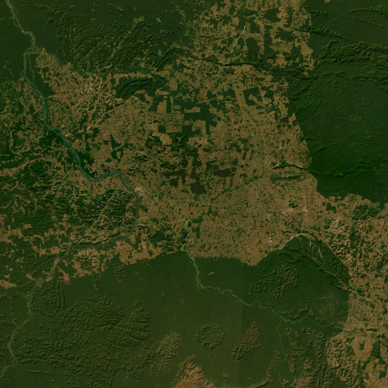
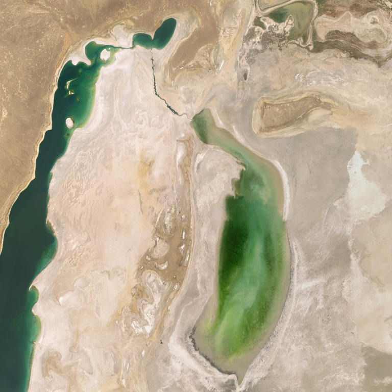
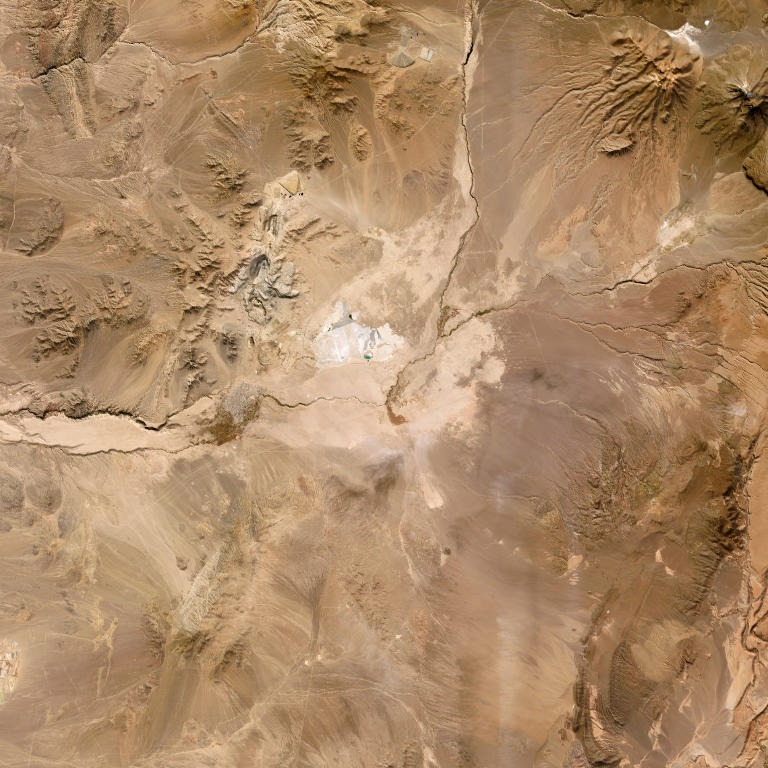

# Group_G — Project Okavango

Project Okavango is a lightweight environmental data analysis tool built for the detection and visualization of at risk natural regions of the world. The project integrates geospatial data with the most recent environmental datasets to analyze and visualize global forest change, land degradation, and ecosystem protection. Results are presented through an interactive Streamlit web application powered by AI driven satellite image analysis.

## Group Members

| Name | Student Number | Email |
|---|---|---|
| João Caseiro | 56517 | joaommcaseiro@gmail.com |
| Catarina Palma | 56526 | catarinapalma01@gmail.com |
| Afonso João | 72008 | ajabjoao@gmail.com |
| Behnia Ghadiani | 71819 | 71819@novabse.pt |

## Installation

### Requirements
- Python 3.10+
- [Ollama](https://ollama.com/download) installed and running locally

### Steps

1. Clone the repository:

        git clone https://github.com/Behnia02/Group_G.git
        cd Group_G

2. Install Python dependencies:

        python -m pip install -r requirements.txt

3. Pull the required Ollama model:

        ollama pull llava:7b

4. Run tests for our dataset download function and meeting function
        
        python -m pytest

5. Run the app:

        python -m streamlit run app/streamlit_app.py

## How to Run the Streamlit App

    python -m streamlit run app/streamlit_app.py

The app has two pages:
- **Environmental Explorer** — interactive world map with 5 environmental indicators
- **AI Workflow** — satellite image download and AI environmental risk assessment

## Repository Structure

The repository is organized to separate the application logic, generated data, development notebooks, and tests.

| Path | Description |
|---|---|
| `app/data_download.py` | Initial function to download environmental datasets. |
| `app/map_merge.py` | Function to map the datasets to world map data. |
| `app/__init__.py` | Necessary for `pytest` to run properly. |
| `app/project_class.py` | Class that includes the main project functions. |
| `app/plots_map.py` | Functions for the visualizations on page 1 of the Streamlit app. |
| `app/plots_charts.py` | Functions for the chart visualizations on page 1 of the Streamlit app. |
| `app/streamlit_app.py` | Main function through which the Streamlit configuration runs for both page 1 and page 2. |
| `app/ai_workflow.py` | Construction of page 2 of the Streamlit app. |
| `app/tile_utils.py` | Generation of ESRI imagery. |
| `app/ollama_utils.py` | Configuration of the Ollama model. |
| `app/db_utils.py` | Constructs the database with the created images. |
| `app/config_loader.py` | Reads our models.yaml file to aid with access to AI settings |
| `assets/` | Contains images used in the README. |
| `database/` | Contains the CSV database with created images and risk assessment results. |
| `downloads/` | Contains the initial environmental datasets after the download function runs. |
| `images/` | Contains images created on page 2 of the app. |
| `notebooks/` | Contains notebooks used to investigate dataset merging with map data and class construction. |
| `tests/` | Contains tests for the initial download and `map_merge` functions. |
| `README.md` | Project documentation and overview. |
| `requirements.txt` | Lists the Python dependencies required to run the project. |
| `main.py` | Main entry point of the project. |
| `ollama.yaml` | Configuration file for the integration of the Ollama model. |

## Notes

- The `app/` folder contains the core application logic.
- Generated and intermediate outputs are stored in dedicated folders such as `downloads/`, `images/`, and `database/`.
- The `notebooks/` folder documents exploration and development steps.
- The `tests/` folder is focused on validating the initial download and dataset merge logic.

## SDGs and Project Impact

Project Okavango was built as a proof of concept for environmental monitoring using open data and local AI models. The tool combines satellite imagery, geospatial datasets, and large language models to identify at risk natural regions anywhere in the world.

The world is facing an accelerating environmental crisis. Forests are disappearing at unprecedented rates, land is being degraded faster than it can recover, and ecosystems that took millennia to form are being destroyed within decades. Traditional monitoring approaches rely on expensive satellite infrastructure, proprietary software, and specialised expertise that many organisations and governments simply do not have access to. Project Okavango demonstrates that meaningful environmental monitoring does not have to be expensive or inaccessible by combining freely available satellite imagery, open environmental datasets, and locally-run AI models that require no internet connection or API fees.

### SDG 15 — Life on Land
This is the most direct connection. The project monitors deforestation, land degradation, ecosystem protection, and mountain biodiversity all core targets of SDG 15. By combining satellite imagery with historical environmental datasets, the tool enables rapid identification of at risk regions, supporting conservation efforts and policy decisions.

### SDG 13 — Climate Action
Deforestation and land degradation are major drivers of climate change. Forests act as carbon sinks, and their destruction releases stored carbon dioxide into the atmosphere. By flagging areas experiencing active forest loss, the tool contributes to early warning systems that can inform climate action at local and national levels.

### SDG 17 — Partnerships for the Goals
The project is built entirely on free and open data sources and open source tools, demonstrating how lightweight accessible tools can be built without proprietary software, enabling wider adoption in lower resource contexts.

### SDG 11 — Sustainable Cities and Communities
The AI Workflow allows users to analyse any location on Earth, including peri urban areas where natural land is being converted to urban use, supporting urban planners in monitoring the environmental impact of city growth on surrounding ecosystems.

In summary, Project Okavango demonstrates how open data, geospatial analysis, and local AI models can be combined into a lightweight tool with real world environmental monitoring applications. With further development, this type of tool could support NGOs, government agencies, and researchers in tracking progress towards the SDGs in near real time. Three concrete examples of the app identifying environmental dangers are provided below.

## How Risk Assessment Works

The risk assessment combines two sources of evidence:

1. **Visual risk score**: a local vision model (llava:7b) analyses the satellite image and scores 5 environmental dimensions: deforestation, degradation, fire, flood, and fragmentation. Each dimension is scored from 0 to 2 based on visible evidence in the image.

2. **Dataset context score**: country level historical data from the 5 environmental datasets is used to compute a national risk score based on percentile rankings and trend direction (improving or worsening).

The final score is a weighted combination of 60% visual evidence + 40% dataset context. Based on the configured thresholds, the result is classified as LOW (below 0.45), MODERATE (0.45–1.0), or HIGH (above 1.0).

## Examples of Environmental Risk Detection

### Example 1 — Amazon Basin, Brazil (HIGH Risk)
**Coordinates:** -6.64, -51.99 — Zoom 9

**AI Description:** Aerial view with patches of dark green vegetation, bare soil, and visible road networks cutting through the landscape. Clear signs of forest fragmentation and land conversion are visible across the image.

**Risk Assessment:** HIGH:  Visual score flagged deforestation and fragmentation. Annual deforestation and forest area change both suggest elevated concern at the national level. Dataset context score: 0.60. Final score: HIGH.

---

### Example 2 — Aral Sea, Kazakhstan (MODERATE Risk)
**Coordinates:** 45.1, 59.1 — Zoom 9

**AI Description:** Satellite view of a dramatically dried up lake surrounded by arid desert terrain. The lake is now largely covered in algae, indicating severe water quality degradation and one of the most well documented ecological disasters in history.

**Risk Assessment:** MODERATE: Visual score flagged land degradation. Land degradation suggests elevated concern at the national level. Land protected and mountain ecosystems add moderate context risk. Dataset context score: 0.52. Final score: MODERATE.

---

### Example 3 — Atacama Desert, Chile (MODERATE Risk)
**Coordinates:** -22.3, -68.9 — Zoom 10

**AI Description:** Desert landscape with rocky terrain, sparse vegetation, exposed rock and sand, eroded terrain, and visible structures in the centre of the image suggesting mining activity.

**Risk Assessment:** MODERATE: Visual score flagged land degradation from mining and erosion. Annual deforestation suggests elevated concern at the national level. Forest area change adds moderate context risk. Dataset context score: 0.46. Final score: MODERATE.
